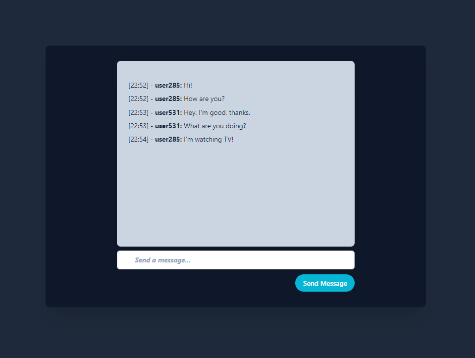

# Websocket Chat

## Description
Project splitted into two applications: 
* a backend app using Java EE to handle websocket sessions and receive/send messages throughout the open sessions.
* a frontend app in Angular with a chat window that allows an user to send messages to another users. 




## Usage

Frontend (npm + Angular):

```typescript
npm intall
ng serve
```

Backend:

```bash
mvn clean install
```

Run Wildfly. For the war deployment, websocket-client.war should be added to $WILDFLY_HOME/standalone/deployments

```bash
cd $WILDFLY_HOME
./bin/standalone.sh 
```
